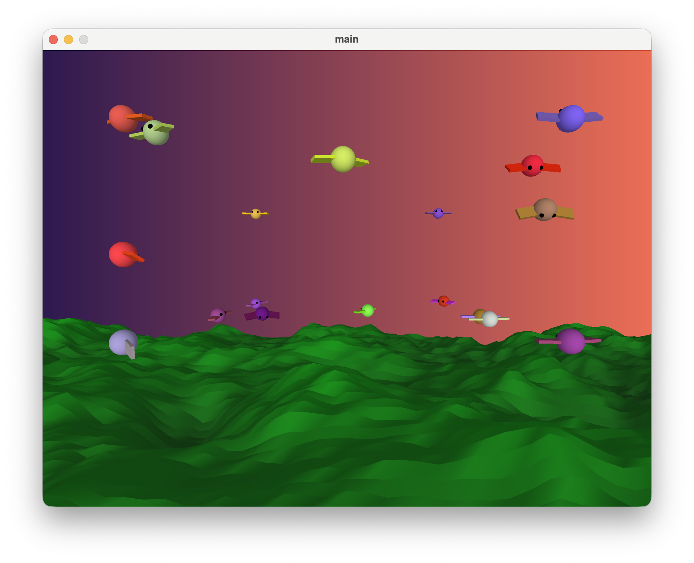
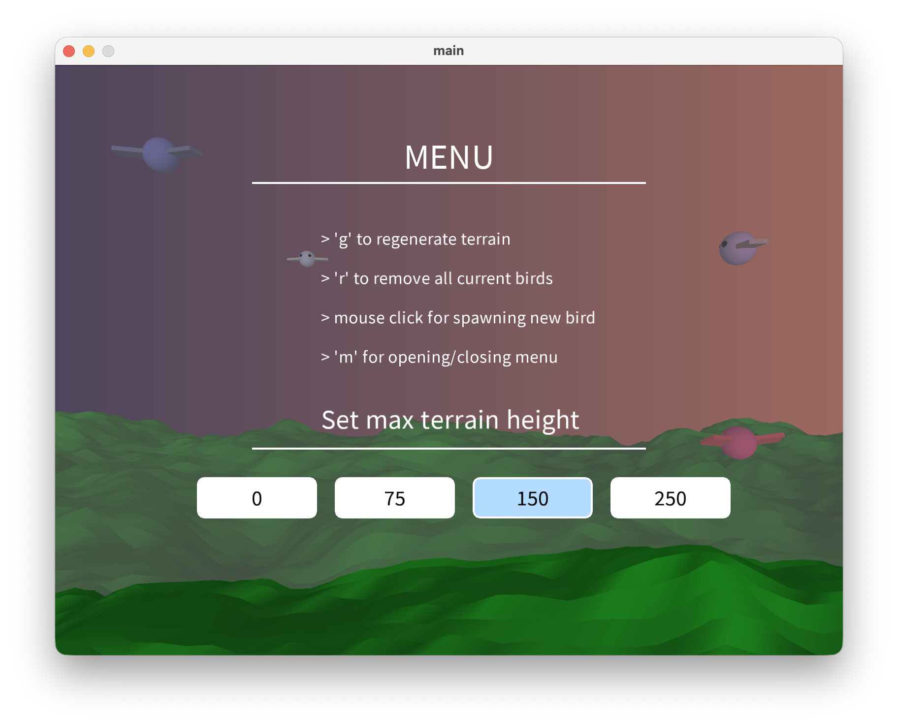

# Algorithms-Final
Submission for the course Algorithms for Creative Technology by Aaron.

</img>
</img>

### Short description:
> This is an interactive 3D game where birds flock together. The player can interact with the flock by *throwing rocks* at the birds or *spawning new birds* into the environment. The terrain beneath the birds is generated using Perlin noise and can be regenerated with different height settings through an *in-game menu*.

*Long desciption:* [View PDF](./docs/3D%20Flocking%20Bird%20Game.pdf)

### General Information
 - Author: **Aaron Struikenkamp s3731944**
 - Course: Algorithms CreaTe 2025/2026
 - No collaboration
 - Adapted code used / code sources:
 - - Flocking: own implementation based on Shiffman's 2D implementation
 - - Particle system: adapted to 3D from my own Assignment 4
 - - Terrain Perlin noise: inspired by Nature of Code, but is my own code

 Other sources consulted in code (like methods and equations)
 - - https://processing.org/examples/flocking.html (Shiffman's flocking methods)
 - - https://www.youtube.com/watch?v=qFSAcCwQS0E (atan & atan2)
 - - https://processing.org/reference/hint_.html (processing disable depth for text)
 - - https://processing.org/reference/ArrayList.html (ArrayList)
 - - https://processing.org/reference/blendMode_.html (blending colours fo particles)
 - - https://processing.org/tutorials/2darray (2D Array for terrain grid)

### AI Usage
> No AI used for programming logic, only for comparing against rubric and catching mistakes.

### Class Diagram
> Made with https://mermaid.live

[![](https://mermaid.ink/img/pako:eNqVVutO4zwQfZUov_pJWURbKKVaIYUktNH2piQsu2xXkZuYNiKNK9sFCoJn_8Z2ruUi7Z_WPp45c_OM86JHJMb6QI9SxJidoBVFm0W2yOReu0xorL0sMk2b_8QRJ1TbEpbwhGR17AGnJEr4vo6hKMIppqiQjUgK6BL4LLESUJJxCfjJM15IIWGudZcSxLUnQ1OLfbF4NnKSyJCq7D-hQndZy6QU7ccJ42-C4E2SqlO03ab7K0Ij3CocuxM7eQi00f0XyrttjDhuyTXD-L6k4IiuMFfmcRZjqmSWhMKaFQpbRIX6F86lyeor5yOyxgzS96nIa1UoD0J5V6iDGtW3UOaHPAeQWlZWQPCUcTIIlM8JM7Rm5BKqNIu14IRb8C53ccK2KdqrTcJmO95qOh9gCDDJlP-itFBnsEDJIyuQFSuXj4a2LtYb9DTCyWrNy1j-_P3zV9tgtlbx5NStXFH8rY2C0WhySP9WOMP0I9dr_s4hLUmU4q79LymHjqgyniZ3uNptc8IxoGMSofSwNEX_SAZ_u8ZUGC_UFKACrnz7vJHyQtgYxa131arfaKi17NZP4vf3jOONykF1RysP3koPy-LhTcI9sNV0VhG16gJ1vw5nzzs_gQIdOllm6aUmXWOq3-CmpkUyuPkZZ0r1-3fYgZsXF2JnzcZj13dn09B2_cCcWo4siTmZj53w0vXs0JpdTwMJzs2bafgr9OeeY9oV8vsdchtazjRwvDpSycxNL3AtoHcmbhB6ZuDUUT-0rwEDjxqyQ8_86Qa_G9jE_BWO3SupDtY8052GN64djOrAyHGHo6CODD3XDn33Vup5M-tHc1OzJOMvDuXmamzOIRTHsZuQOR2OKylrNvUDYSsIc6MfHTn28EMVy5w4nvnRie3MVXDyQITfdEUgVzMvr6EDiZKJDG_KHJhjdzidQHFqmDUbOX5TzAbAcyD2kqO0MRVCl7NrT16Yg4sGveVjru6Z6vDtjm7TWscTirJV3i7QjpfFA3pw2y-HigRmcJzgjHtwz2U_Pakhtze05gjM50m7XHWahBOc7RTlkhBor0xja_Io0KKVGbzvEcdxPmKrOQyHMIMfULpTfe9zmmQrgFK0xCmrZtuSZzeG-B3Vxre2BJeXexWxsDkCvvxNhZ1arVEWp9hKE3itCr_lt8q3bxdV_9awYhosMvlSHoiVWCV2MOPEYTXYqmOYL0294i07sCDTKbD8XDf0FU1ifXCHUoYNfYPpBom9LnO-0Pkab_BCH8AyRvR-oUOUoLRF2S0hG33A6Q7UKNmt1iWJGpf5R1wpIiefRXYZ1wf94xPJoQ9e9CfY9o9Oe51ur9M7O-6f90_gcK8P2u2j7ln_7LTb63Xax-fds9NXQ3-WVo-Pzk9Pjnvn7U63fd7vnHR6ho7jBEbqJP-MFH-v_wNyGHYu?type=png)](https://mermaid.live/edit#pako:eNqVVllvozoU_iuIp1yJGbXpkkWjShRogm42AZ3OdDJCDrgJKsHIdtqmVfvb77HNmi7SfUnsz-d8Z_M55kWPSIz1oR6liDE7QWuKtstsmcm9dpnQWHtZZpq2-IkjTqiWE5bwhGRN7AGnJEr4vomhKMIppqiUjUgK6Ar4LLESUJJxCfjJM15KIWGuc5cSxLUnQ1OLfbl4NgqSyJCq7B-hQndZx6QU7ScJ42-C4E2SqlOU5-n-itAId0rH7sROHgJtdP-F8i6PEccduWYY31cUHNE15so8zmJMlcyKUFizUiFHVKh_4VyarL9yPiIbzCB9n4q81oXyIJR3hTqoUXMLZX4ocgCpZVUFBE8VJ4NA-YIwQ2tHLqFas1wLTrgF73IXJyxP0V5tEjbf8U7b-QBDgEmm_BelhTqDBUoeWYmsWbV8NLRNud6ipzFO1htexfLn75-_2hazjYqnoO4UiuJvY5SMRptD-rfGGaYfud7wdwFpSaIUn9j_J-XQEXXG0-QO17u8IJwAOiERSg9LU_aPZPDzDabCeKmmABVw7dvnjVQUwsYo7ryrVvNGQ61lt34Sv79nHG9VDuo7WnvwVnlYFQ9vE-6BrbaziqjTFGj6dTh73vkJFOjQySpLLw3pBlPzBrc1LZLBzc84U6o_fsAO3Ly4EDtrPpm4vjufhbbrB-bMcmRJzOli4oSXrmeH1vx6FkhwYd7Mwl-hv_Ac066R3--Q29ByZoHjNZFaZmF6gWsBvTN1g9AzA6eJ-qF9DRh41JIdeeZPN_jdwqbmr3DiXkl1sOaZ7iy8ce1g3ATGjjsaB01k5Ll26Lu3Us-bW_-2Nw1LMv7yUG6uJuYCQnEcuw2Zs9GklrLmMz8QtoKwMPrRkWOPPlSxzKnjmR-d2M5CBScPRPhtVwRyNfeKGjqQKJnI8KbKgTlxR7MpFKeBWfOx47fFbAA8B2KvOCobMyF0Ob_25IU5uGjQWz7m6p6pDs93NE8bHU8oytZFu0A7XpYP6MFtvxwpEpjBcYIz7sE9l_30pIbc3tDaI7CYJ8fVqtsmnOJspyhXhEB7ZRrbkEeBlq3M4H2POI6LEVvPYTiEGfyA0p3qe5_TJFsDlKIVTlk921Y8uzHE77gxvrUVuLzaq4iFzTHwFW8q7NRqg7I4xVaawGtV-i2_Vb59u6j7t4GV02CZyZfyQKzCarGDGScO68FWH8N8aeuVb9mBBZlOgRXnuqGvaRLrwzuUMmzoW0y3SOx1mfOlzjd4i5f6EJYxovdLHaIEpRxlt4Rs9SGnO1CjZLfeVCRqXBYfcZWInHwW2WVcH_YGfcmhD1_0J304OPp-dt496fUG3cF5v3dm6Ht92O1-P-n1e-f9QfeoP-ifnvRfDf1ZGj36Pjg7PTofHHdPjgf97mn33NBxnMBEnRZfkeLv9T8Jt3Yd)

### Currently implemented features:
- [x] 3D Flying Birds (Boids)
- [x] 3D Flocking --> Based on Shifmann's code
- [x] 3D Terrain generation
- [x] Gradient background
- [x] Menu with instructions
- [x] Ability to alter 3D Space
- - [x] Regenerate terrain
- - [x] Spawn and remove birds
- - [x] Remove all current birds to start over
- [x] Particle system
- - [x] particle class
- - [x] particle system class
- [x] Meaningful user interaction
- - [x] Throw rocks!
- - [x] Make rocks despawn birds
- - [x] Add particles upon despawn
- [x] Spawn birds normally distributed

### Todo:
Not much I guess.

### Check for final assignment / rubric
- [x] Noise
- - [x] Perlin noise --> Terrain
- - [x] Gaussian noise --> Bird spawning
- [x] PVector Physics
- [x] Flocking --> 3D adapted bird flocking
- [x] Particle System